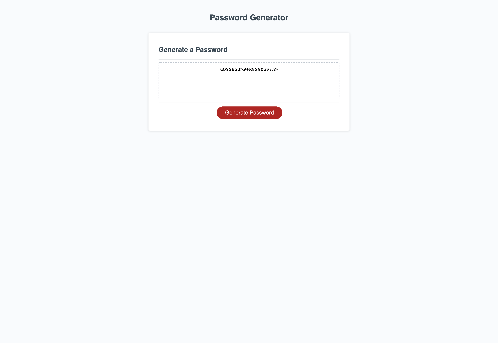

# Password-Generator.

This is a automatic password generator project that uses the user's preferences to generate their password. In this project you prompt the user to enter the length of their password which is between number 8 and 128. Ask them to confirm whether or not to include lowercase, uppercase, numbers and special characters and in the end a password is generated according to their preferences automatically.

# Screenshot of the project.

# Links.

- The link to deploy the application: https://bongomin256.github.io/Password-Generator/
